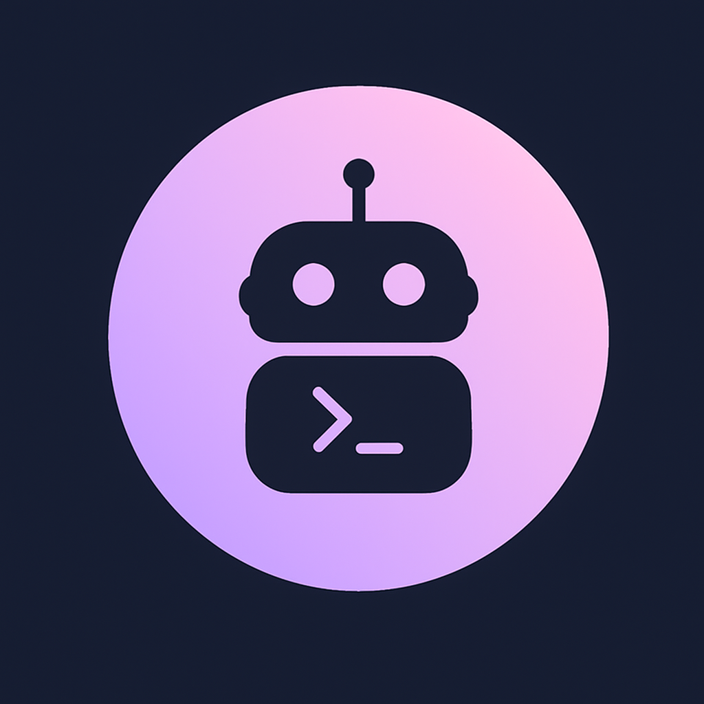
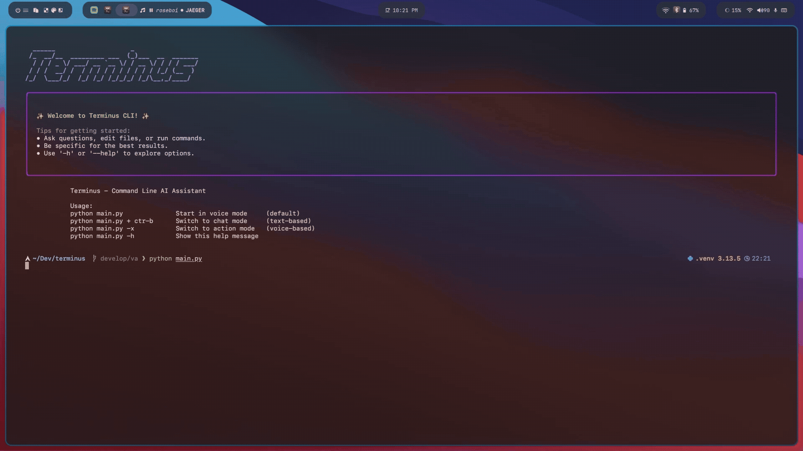

# Terminus 

**Terminus** is an open-source, intelligent CLI-based AI agent with support for both **chat** and **voice** modes. Designed for natural interaction and seamless productivity, Terminus acts as your command-line companion—powered by advanced language models and speech processing.  

<div align="center">
  
</div>


<!-- 🔥 Feature Badges -->
<p align="center">
  
  
  
  
  
  
</p>




## ✨ Features

| Feature | Description |
|--------|-------------|
| 💬 **Dual Interaction Modes** | Chat and Voice support via CLI |
| 🧠 **Multi-LLM Backend** | OpenAI, Anthropic, Local LLMs |
| 🧩 **Modular Multi-Agent System** | Task-specific agents with memory and tools |
| 🔗 **External Tool Integration** | Google Calendar, Gmail, and more |
| 📚 **RAG Capabilities** | Retrieval-Augmented Generation using your own data |
| 🔧 **Extensible Plugins** | Add custom commands, agents, tools |
| ⚙️ **.env-Based Config** | API key and feature toggling via environment variables |
| 🧪 **Cross-Platform** | Works on macOS, Linux, and Windows/WSL |


## 📦 Dependencies

Pre-requiste setup: 
```
git clone https://github.com/0xs1d/terminus.git
cd terminus
pip install -r requirements.txt
python cli/agent.py download-files
python cli/main.py     # fires the agent in voice mode
```

This project is also dependent on following apis:
```
DEEPGRAM_API_KEY=<Your Deepgram API Key>
OPENAI_API_KEY=<Your OpenAI API Key>
CARTESIA_API_KEY=<Your Cartesia API Key>
LIVEKIT_API_KEY=<your API Key>
LIVEKIT_API_SECRET=<your API Secret>
LIVEKIT_URL=<your LiveKit server URL>
COMPOSIO_API_KEY=<your composio API Key>
```

## 🙌 Contribute

We welcome contributions, ideas, and feature requests!

- Open an [issue](https://github.com/0xs1d/terminus/issues)
- Submit a pull request
- Join the [discussion](https://github.com/0xs1d/terminus/discussions)

---

<p align="center"><b>Terminus is your terminal’s AI brain 🧠. Try it today.</b></p>


